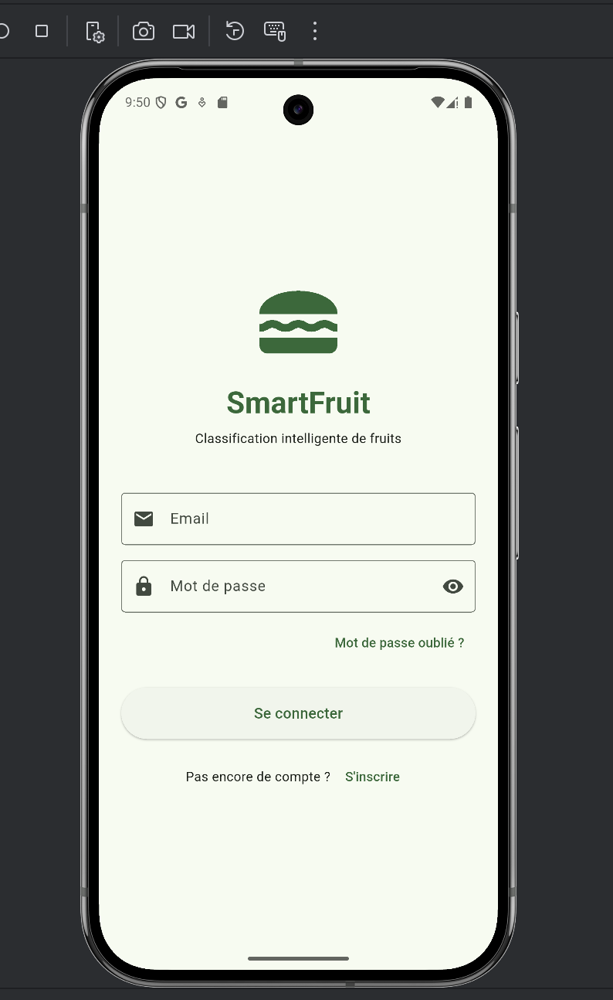
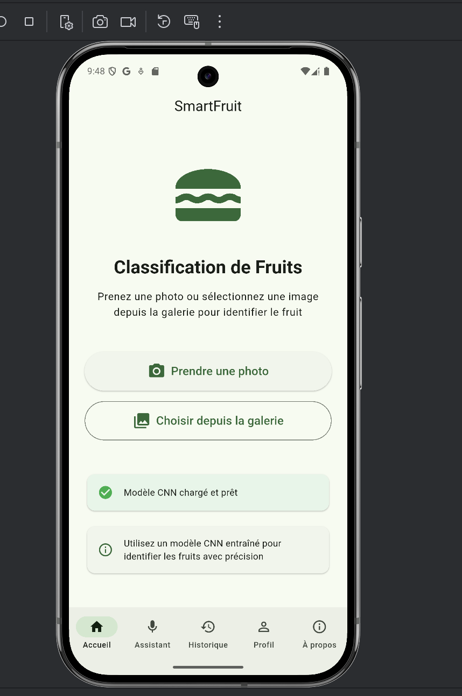
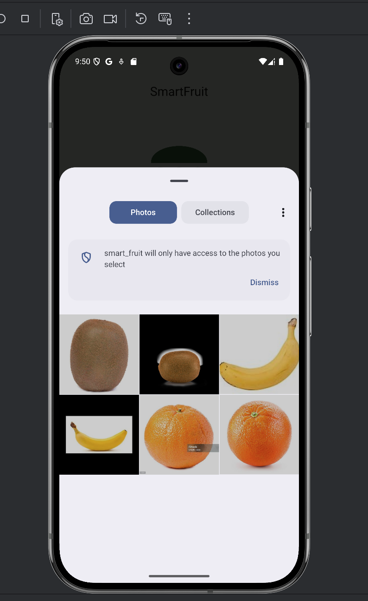
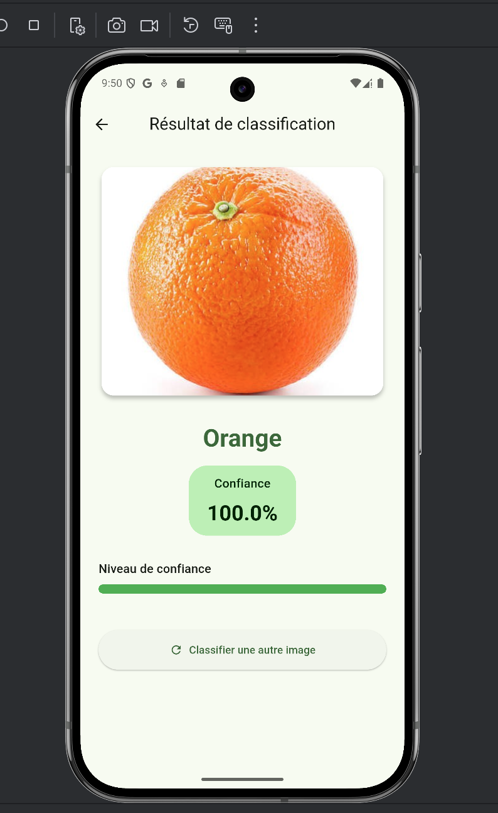
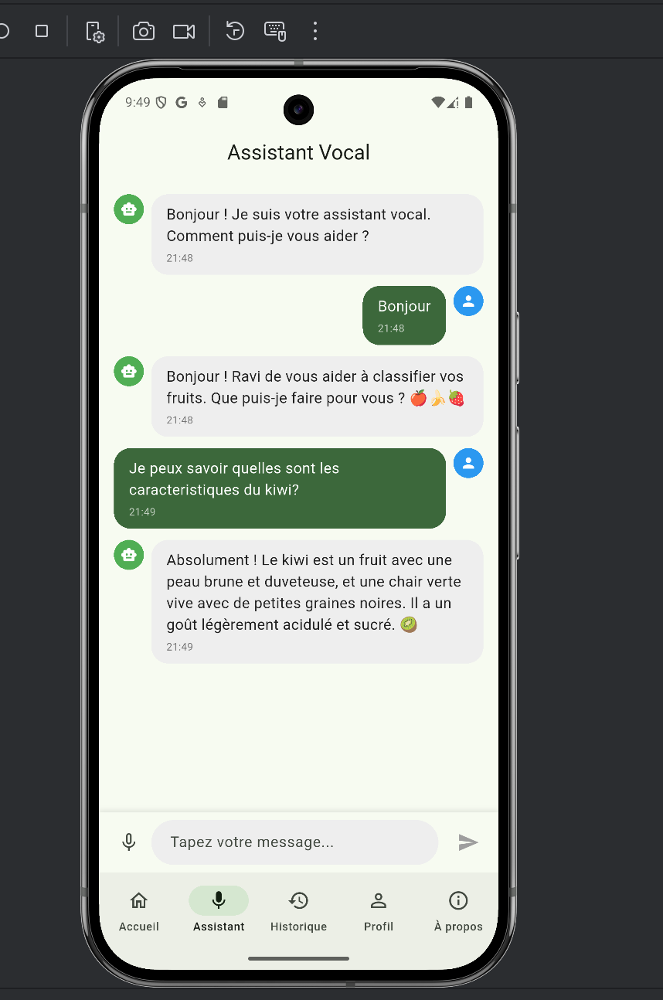
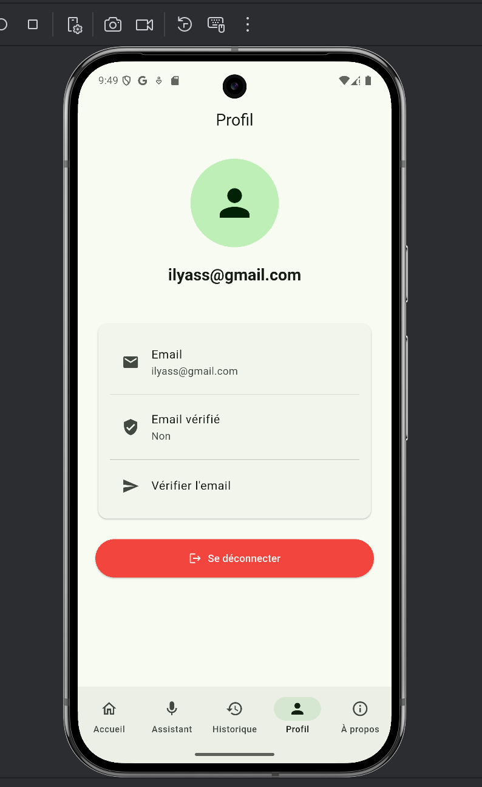

# SmartFruit 🍎

A cross-platform mobile application built with Flutter that combines computer vision, artificial intelligence, and voice interaction to classify fruits in real-time.

## 🎓 Academic Context
This project was developed as part of a school course (EMSI) in Cross-Platform Development and Deep Learning.

## 🌟 Features

### 🔐 Firebase Authentication
- User sign-up and login via email/password
- Password recovery functionality
- Secure user session management

### 📸 Fruit Classification
- **Real-time image classification** using a custom CNN model
- Capture photos from camera or select from gallery
- Displays predicted fruit name and confidence score
- Model: TensorFlow Lite (TFLite) with 15 fruit classes
- Supports 100x100 input images with optimized preprocessing

### 🗣️ Voice Assistant
- **Speech-to-Text (STT)**: Voice input recognition
- **AI-powered responses**: Integration with Google Gemini API (`gemini-2.5-flash-lite`)
- **Text-to-Speech (TTS)**: Vocal response synthesis
- Chat-like interface with conversation history
- Persistent conversation state across navigation

### 📱 User Interface
- Modern Material Design 3 UI
- Bottom navigation with 5 tabs:
  - **Home**: Fruit classification interface
  - **Voice Assistant**: AI chat with voice interaction
  - **History**: Classification history (placeholder)
  - **Profile**: User profile and settings
  - **About**: Application information

## 🛠️ Technology Stack

### Frontend
- **Framework**: Flutter 3.x (Dart)
- **UI**: Material Design 3
- **State Management**: Flutter StatefulWidget

### Backend & Services
- **Authentication**: Firebase Authentication
- **Database**: Cloud Firestore (optional, for future features)
- **AI API**: Google Gemini (`gemini-2.5-flash-lite`)
- **ML Model**: TensorFlow Lite (CNN)

### Packages & Dependencies
```yaml
- firebase_core: ^3.6.0
- firebase_auth: ^5.3.1
- cloud_firestore: ^5.4.4
- image_picker: ^1.0.7
- image: ^4.1.3
- tflite_flutter: ^0.12.1
- speech_to_text: 7.3.0
- flutter_tts: 4.0.2
- http: ^1.2.0
- flutter_dotenv: ^5.1.0
```

## 📋 Prerequisites

- Flutter SDK (>=3.2.0)
- Dart SDK (>=3.2.0 <4.0.0)
- Android Studio / Xcode (for iOS)
- Firebase project (with Authentication enabled)
- Google Gemini API key
- TensorFlow Lite model (`fruits_model15.tflite`)

## 🚀 Getting Started

### 1. Clone the Repository
```bash
git clone https://github.com/IlyassEz05/SmartFruit.git
cd SmartFruit
```

### 2. Install Dependencies
```bash
flutter pub get
```

### 3. Firebase Setup

1. Create a Firebase project at [Firebase Console](https://console.firebase.google.com/)
2. Enable **Email/Password** authentication in Firebase Console
3. Download `google-services.json` for Android
4. Place it in `android/app/google-services.json`

### 4. Environment Variables

Create a `.env` file at the project root:

```env
# Gemini API Configuration
GEMINI_API_KEY=your_gemini_api_key_here

# OpenAI API Configuration (optional, not used if Gemini is enabled)
OPENAI_API_KEY=sk-REPLACE_ME
OPENAI_MODEL=gpt-4o-mini
```

⚠️ **Important**: The `.env` file is already in `.gitignore`. Never commit your API keys!

### 5. TFLite Model

Place your trained TFLite model in `assets/models/`:
- Model file: `fruits_model15.tflite`
- Input size: 100x100x3 (RGB)
- Output: 15 classes (softmax probabilities)

The model should be trained with:
- Image preprocessing: `rescale=1./255` (normalization to 0-1)
- Input shape: `(100, 100, 3)`
- Output: Dense layer with 15 units + softmax

### 6. Android Configuration

Minimum SDK version: **26** (required by `tflite_flutter`)

The `android/app/build.gradle.kts` is already configured with:
```kotlin
minSdk = 26
```

### 7. Run the Application

```bash
# For Android
flutter run

# For specific device
flutter run -d <device-id>
```

## 📁 Project Structure

```
smart_fruit/
├── lib/
│   ├── config/
│   │   └── api_config.dart          # API configuration (Gemini/OpenAI)
│   ├── screens/
│   │   ├── auth/
│   │   │   ├── login_screen.dart
│   │   │   └── signup_screen.dart
│   │   └── main/
│   │       ├── main_menu_screen.dart
│   │       ├── home_screen.dart
│   │       ├── voice_assistant_screen.dart
│   │       ├── profile_screen.dart
│   │       └── about_screen.dart
│   ├── services/
│   │   ├── ai_service.dart          # Gemini/OpenAI API integration
│   │   ├── auth_service.dart        # Firebase Authentication
│   │   ├── image_service.dart       # Image picker (camera/gallery)
│   │   ├── speech_service.dart      # Speech-to-Text
│   │   ├── tts_service.dart         # Text-to-Speech
│   │   └── tflite_service.dart      # TFLite model inference
│   └── main.dart
├── assets/
│   └── models/
│       └── fruits_model15.tflite    # Trained CNN model
├── android/
│   └── app/
│       └── google-services.json     # Firebase config (not in repo)
├── .env                             # API keys (not in repo)
├── pubspec.yaml
└── README.md
```

## 🎯 Usage

### Fruit Classification
1. Navigate to the **Home** tab
2. Tap "Prendre une photo" to capture from camera, or "Choisir depuis la galerie" to select an image
3. The app processes the image and displays:
   - Predicted fruit name
   - Confidence percentage
   - Illustrative image (if available)

### Voice Assistant
1. Navigate to the **Voice Assistant** tab
2. Tap the microphone icon to speak, or type your message
3. The assistant responds via:
   - Text display in chat bubbles
   - Voice synthesis (TTS)
4. Conversation history is preserved when switching tabs

## 🔧 Configuration

### Switching AI Provider

Edit `lib/config/api_config.dart`:

```dart
// For Gemini (current)
static const bool useGemini = true;
static String get geminiModel => 'gemini-2.5-flash-lite';

// For OpenAI
static const bool useGemini = false;
```

### Model Configuration

Edit `lib/services/tflite_service.dart`:

```dart
static const String MODEL_PATH = 'assets/models/fruits_model15.tflite';
static const int INPUT_SIZE = 100;
static const int NUM_CLASSES = 15;
static const List<String> LABELS = [
  'Apple', 'Banana', 'Cherry', 'Coconut', 'Grape',
  // ... (15 classes total)
];
```

## 📝 Model Training

The CNN model is trained using TensorFlow/Keras. A sample training script is provided (`train_model.py`).

### Training Parameters
- Architecture: CNN with Conv2D, BatchNormalization, MaxPooling2D, Dense layers
- Input size: 100x100x3 (RGB)
- Data augmentation: Rotation, zoom, horizontal flip
- Optimizer: Adam
- Loss: Categorical crossentropy
- Output: 15 classes with softmax activation

### Converting to TFLite
```python
converter = tf.lite.TFLiteConverter.from_keras_model(model)
tflite_model = converter.convert()
with open('fruits_model15.tflite', 'wb') as f:
    f.write(tflite_model)
```

## 🐛 Troubleshooting

### Emulator Network Issues
If you see "Failed host lookup" errors:
1. Open Chrome in the emulator and test internet connectivity
2. In Android Studio: Device Manager → Cold Boot Now
3. Check proxy/DNS settings if behind a corporate network

### Model Loading Errors
- Ensure `fruits_model15.tflite` is in `assets/models/`
- Verify `pubspec.yaml` includes the model in assets
- Check model input/output shapes match the service configuration

### API Key Errors
- Verify `.env` file exists at project root
- Check API key format (Gemini keys start with `AIza`)
- Ensure `flutter_dotenv` loads `.env` in `main.dart`

## 📸 Screenshots

### 🔐 Authentication


### 🏠 Home



### 🍎 Fruit Classification



### 🗣️ Voice Assistant


### 🗣️ Profile


### 🗣️ About


## 📄 License

This project is part of an academic project. See LICENSE file for details.

## 👤 Author

**IlyassEz05**
- GitHub: [@IlyassEz05](https://github.com/IlyassEz05)

## 🙏 Acknowledgments

- Flutter team for the amazing framework
- Google for Firebase and Gemini APIs
- TensorFlow team for TFLite
- The open-source community

## 📚 Additional Resources

- [Flutter Documentation](https://docs.flutter.dev/)
- [Firebase Documentation](https://firebase.google.com/docs)
- [Google Gemini API](https://ai.google.dev/docs)
- [TensorFlow Lite Guide](https://www.tensorflow.org/lite)

---

⭐ **Star this repo if you find it helpful!**
